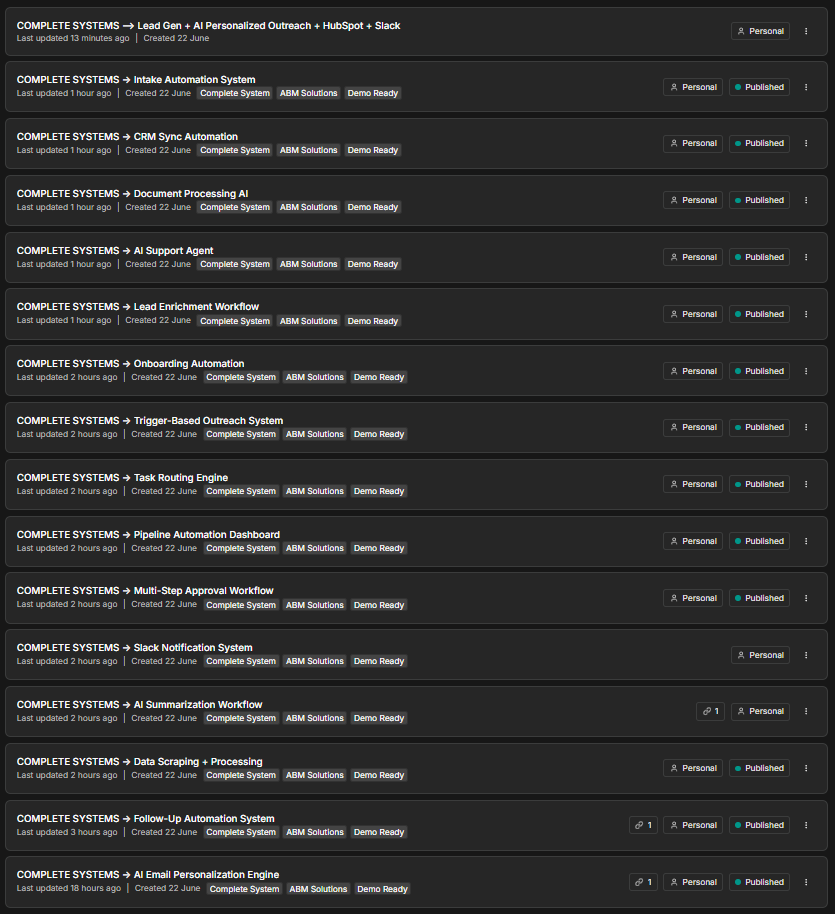

# n8n AI Automation Complete Systems

A portfolio of 16 production-ready n8n automation systems covering AI, sales, CRM, operations, onboarding, document processing, customer support, and business workflows.

These systems demonstrate multi-step automation architecture, AI integration, API orchestration, conditional routing, data processing, approval controls, notifications, and reusable business logic.



## Complete Systems

| System | Primary Function | Business Value |
|---|---|---|
| [AI Email Personalization Engine](ai-email-personalization-engine.json) | Generates personalized outreach emails using prospect data | Improves outreach relevance and response rates |
| [AI Summarization Workflow](ai-summarization-workflow.json) | Converts long-form information into structured summaries | Reduces manual review time |
| [AI Support Agent](ai-support-agent.json) | Classifies support requests and prepares responses | Improves response speed and consistency |
| [CRM Sync Automation](crm-sync-automation.json) | Synchronizes customer data across business systems | Prevents fragmented or outdated records |
| [Data Scraping and Processing](data-scraping-processing.json) | Collects, cleans, and structures external data | Accelerates research and data preparation |
| [Document Processing AI](document-processing-ai.json) | Extracts and processes information from documents | Reduces repetitive document handling |
| [Follow-Up Automation System](follow-up-automation-system.json) | Automates scheduled and conditional follow-ups | Prevents opportunities from being missed |
| [Intake Automation System](intake-automation-system.json) | Validates and routes incoming requests | Creates a consistent intake process |
| [Lead Enrichment Workflow](lead-enrichment-workflow.json) | Adds company and contact intelligence to lead records | Improves qualification and personalization |
| [Lead Generation, AI Outreach, HubSpot and Slack](lead-gen-ai-outreach-hubspot-slack.json) | Connects prospecting, AI outreach, CRM tracking, and notifications | Demonstrates an end-to-end revenue workflow |
| [Multi-Step Approval Workflow](multi-step-approval-workflow.json) | Routes requests through structured approval stages | Improves governance and accountability |
| [Onboarding Automation System](onboarding-automation-system.json) | Coordinates onboarding tasks and communications | Creates a faster, more consistent client experience |
| [Pipeline Automation Dashboard](pipeline-automation-dashboard.json) | Processes pipeline activity and performance data | Improves operational visibility |
| [Slack Notification System](slack-notification-system.json) | Sends structured workflow alerts to Slack | Keeps teams informed automatically |
| [Task Routing Engine](task-routing-engine.json) | Assigns work based on configurable conditions | Reduces manual coordination |
| [Trigger-Based Outreach System](trigger-based-outreach-system.json) | Initiates outreach when defined events occur | Enables timely, scalable engagement |

## Architecture

```mermaid
flowchart TD
    A[Trigger or Input] --> B[Validation and Processing]
    B --> C[AI or Business Logic]
    C --> D{Routing Decision}
    D --> E[External Application]
    D --> F[CRM or Data Store]
    D --> G[Notification or Approval]
    E --> H[Structured Result]
    F --> H
    G --> H
